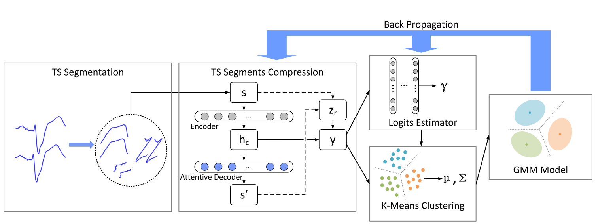

# Seq2GMM

## Abstract

Many real-world multivariate time series are collected from a network of physical objects embedded with software, electronics, and sensors. The quasi-periodic signals generated by these objects often follow a similar repetitive and periodic pattern, but have variations in the period, and come in different lengths as well as non-uniformed sampling caused by **timing (synchronization) errors**. Given a multitude of such quasi-periodic time series, can we build machine learning models to identify those time series that behave differently from the majority of the observations? In addition, can the models help human experts to understand how the decision was made? 

We propose a sequence to **Gaussian Mixture Model (seq2GMM) framework**. The overarching goal of this framework is to identify unusual and interesting time series within a network time series database. We further develop a surrogate-based optimization algorithm that can efficiently train the seq2GMM model. Seq2GMM exhibits strong empirical performance on a plurality of public benchmark datasets, outperforming state-of-the-art anomaly detection techniques by a significant margin. We also theoretically analyze the convergence property of the proposed training algorithm and provide numerical results to substantiate our theoretical claims.

Seq2GMM is composed of three blocks, namely the temporal segmentation, the temporal compression network, the estimation network with GMM.




## Contributions

- Learning without anomaly training samples
- Robust against timing errors
- Visualization and localizaiton
- State of the art

## Cite This

```
@ARTICLE{9765466,
  author={Yang, Kai and Dou, Shaoyu and Luo, Pan and Wang, Xin and Poor, Vincent},
  journal={IEEE Transactions on Network Science and Engineering}, 
  title={Robust Group Anomaly Detection for Quasi-Periodic Network Time Series}, 
  year={2022},
  volume={},
  number={},
  pages={1-1},
  doi={10.1109/TNSE.2022.3170364}}
```

## Requirement

- python>=3.6
- tensorflow>=1.12 (The code has not been tested on tensorflow2)
- pwlf==1.1.0

## Quick start

```
git clone https://github.com/KMdsy/seq2gmm.git
cd seq2gmm
```

Train & Test Seq2GMM example

```python
# Train
python main.py # train a seq2gmm and test it every 10 epoch

# Test 
python test.py # test using a trained model
```

The train logs and trained model will be saved under `log` and  `checkpoint` respectively.

We also provide some trained model under `trained_model` .


